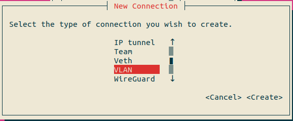
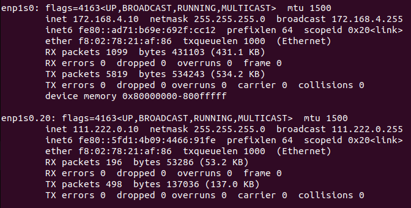

# ROS2/DDS-TSN on KR260 

# Description
In practical application of the `TSN (Time-Sensitive Networking) protocol IEEE 802.1AS`, the `Linux PTP Project (LinuxPTP API)` was utilized to `synchronize the system time` of two different development boards, `Innodisk ASCI-020 (Intel Elkhart Lake)` and `Xilinx KR260`. Then, the ROS2-TSN script provided inside the KR260 was utilized to integrate TSN with ROS2. Additionally,`ROS2's middleware - DDS (Data Distribution Service)` was used to enhance the reliability of transmitting ROS2 messages.

# Table of Contents
[Specification Requirements](#specification-requirements)
- [Dendencies on platfrom](#dendencies-on-platfrom)

[Build ROS2-DDS-TSN package](#build-ros2-dds-tsn-package)
- [Build Repository in Elkhart lake](#build-repository-in-elkhart-lake)
- [Build Repository in KR260](#build-repository-in-kr260)

[IP Configuration](#ip-configuration)
- [Use Network Manager - nmtui to set network IP](#use-network-manager---nmtui-to-set-network-ip)
- [Add VLAN in Elkhart Lake ip port (enp1s0 -> enp1s0.20)](#add-vlan-in-elkhart-lake-ip-port-enp1s0---enp1s020)
- [Use ifconfig to view the IP address](#use-ifconfig-to-view-the-ip-address)

[Execution Steps](#execution-steps)
- [How to use TSN Hardware clock to sync linux system time](#how-to-use-tsn-hardware-clock-to-sync-linux-system-time)
  - [[KR260 <-> KR260] Execute PHC (PTP Hardware Clock) synchronization using the script provided by Xilinx](#kr260---kr260-execute-phc-ptp-hardware-clock-synchronization-using-the-script-provided-by-xilinx)
  - [[Elkhart lake <-> KR260] How to Synchronize PTP Hardware clock using linuxptp](#elkhart-lake---kr260-how-to-synchronize-ptp-hardware-clock-using-linuxptp)
- [ROS2-TSN](#ros2-tsn)
    - [[KR260 <-> KR260] Use the script provided by Xilinx to operate ROS2](#kr260---kr260-use-the-script-provided-by-xilinx-to-operate-ros2)
    - [[Elkhart lake <-> KR260] Use a custom-built ROS2 package to modify scripts provided by Xilinx](#elkhart-lake---kr260-use-a-custom-built-ros2-package-to-modify-scripts-provided-by-xilinx)

[Custom-built ROS2-DDS-TSN package](#custom-built-ros2-dds-tsn-package)
  - [Calculate the system time delay after PTP synchronization using ROS2](#calculate-the-system-time-delay-after-ptp-synchronization-using-ros2)
  - [Use ROS2 Publish /Subscribe image folder](#use-ros2-publish-subscribe-image-folder)
    - [Start ROS2 publish images from folder](#start-ros2-publish-images-from-folder)
    - [Select a image folder](#select-a-image-folder)
    - [Start ROS2 subscribe images from folder (another bash)](#start-ros2-subscribe-images-from-folder-another-bash)
    - [Result](#result)
  - [How to use DDS-TSN demo](#how-to-use-dds-tsn-demo)
    - [Execute dds tsn demo](#execute-dds-tsn-demo)
    - [VLAN-to-PCP mapping using egress-qos-map](#vlan-to-pcp-mapping-using-egress-qos-map)
    - [Interference using iperf3 (without/with DDS QoS profoile)](#interference-using-iperf3-withoutwith-dds-qos-profoile)
  - [How to use ROS2 circle car](#how-to-use-ros2-circle-car)
    - [Gazebo simulator (world_circle_launch.py & world_circle_top_launch.py)](#gazebo-simulator-world_circle_launchpy--world_circle_top_launchpy) 
    - [Circle controller (circle_launch.py)](#circle-controller-circle_launchpy)
    - [Partial circle (part_circle_launch.py)](#partial-circle-part_circle_launchpy)
    - [Result](#result-1)
  - [Measure TSN performance](#measure-tsn-performance)
    - [Capture DDS-TSN demo packets using tshark](#capture-dds-tsn-demo-packets-using-tshark)
    - [Analyze the test results](#analyze-the-test-results)
      - [Sending interference with iperf3 will cause packet loss](#sending-interference-with-iperf3-will-cause-packet-loss)
      - [Export fast dds qos file](#export-fast-dds-qos-file)
    
[References](#references)
# Specification Requirements

## Dendencies on platfrom
- Software
  - `Ubuntu 22.04`
  - `ROS2 Humble`
  - `RTI Connext DDS `for x86
  - `eProsima Fast DDS `for ARM64
  - `LinuxPTP`
  - `IEEE 802.1AS`
- Hardware
  - `Xilinx KR260`
  - `Innodisk ASCI-020 (Intel Elkhart Lake)`
  - `NIC support TSN`

# Build ROS2-DDS-TSN package
- `Colcon build` Elkhart lake & KR260
## Build Repository in Elkhart lake 
1. git clone
    ```bash
    git clone https://github.com/aiotads/ros2_dds_tsn.git ~/ros2_dds_tsn
    ```
2. Build DDS (connextdds) on x86
    ```bash
    ######      Elkhart lake X86     ######
    sudo apt install -y ros-humble-rmw
    sudo apt install -y ros-humble-rmw-connextdds
    source /opt/ros/humble/setup.bash
    git clone https://github.com/rticommunity/rmw_connextdds.git~/rmw_connextdds
    cd ~/rmw_connextdds
    git checkout humble
    colcon build
    source ~/rmw_connextdds/install/setup.sh
    export RMW_IMPLEMENTATION=rmw_connextdds
    ```
3. Build Repository
    ```bash
    cd /ros2_dds_tsn/elkhartlake
    colcon build
    ```
## Build Repository in KR260
1. Control the terminal of KR260 using minicom.
    ```bash
    sudo minicom -D /dev/ttyUSB1
    ```
2. git clone Repository
    ```bash
    git clone https://github.com/aiotads/ros2_dds_tsn.git ~/ros2_dds_tsn
    ```
3. Build DDS (fastrtps) on ARM64
    ```bash
    ######           KR260           ######
    sudo apt install -y ros-humble-rmw
    sudo apt install -y ros-humble-ros-humble-rmw-fastrtps-cpp
    export RMW_IMPLEMENTATION=rmw_fastrtps_cpp
    ```
4. Build Repository
    ```bash
    cd ~/ros2_dds_tsn/kr260 
    colcon build
    ```
5. Power off and restart !
6. Load xilinx app to enable tsn ethernet interface[eth2] on KR260
    ```bash
    sudo xmutil listapps 
    # Check if the TSN app (kr260-tsn-rs485pmod) is in the list of apps.
    sudo xmutil unloadapp
    sudo xmutil loadapp kr260-tsn-rs485pmod
    ```
7. Set up KR260 for tsn board 2 
    ```bash
    source /usr/bin/net_setup.sh -b2 #tsnb2
    ```
    

# IP Configuration
|Device|NIC|IP Address|VLAN|
|:-|:-|:-|:-|
|`Elkhart lake`|enp1s0|172.168.4.10 (enp1s0)|111.222.0.10 (enp1s0.20)(Master mode)|
|`KR260`|eth2(PL)|172.168.4.99 (ep)|111.222.0.10(ep.20)(Master Mode)<br>111.222.0.20 (ep.20)(Slave Mode)|


## Use Network Manager - `nmtui` to set network IP
  ```bash
  # sudo apt-get install network-manager
  sudo nmtui
  ```
1. Edit a connection<br>

2. Add<br>    

3. Create Ethernet type connection<br>

4. Elkhart lake - enp1s0 : 172.168.4.10<br>

5. KR260 - ep : 172.168.4.99<br>

6. Activate the created mode<br>
<br>
 

## Add VLAN in Elkhart Lake ip port (enp1s0 -> enp1s0.20)
1. Create VLAN type connection<br>

2. VLAN - enp1s0.20 = 111.222.0.10<br>

3. After add vlan ip ,activate the mode<br>


## Use ifconfig to view the IP address
```bash
ifconfig
```
- Elkhart lake </br>

- KR260 </br>


# Execution Steps
## How to use TSN Hardware clock to sync linux system time
- If the time on `two different development boards` is not corrected via the Internet using NTP as the reference, the `initial time will stop counting when the system is turned off`, causing the clock that keeps
 track of system time to halt. However, by using the `PTP` function, it is possible to adjust one's own system time based on the system time of the `Master`, even without an Internet connection. In this case, we use `Elkhart Lake` as the `Master` to serve as the reference for system time, to correct the system time of the `KR260`.
- The current initial system time on the KR260 was `2023-03-02 21:17:59 CST`with host system time difference `9052285.229430914` seconds,it is not synchronization.<br>

### [KR260 <-> KR260] Execute PHC (PTP Hardware Clock) synchronization using the script provided by Xilinx

1. To establish a usable TSN (Time-Sensitive Networking) network, it is necessary to set up VLAN (Virtual Local Area Network), and configure the master and slave.
    ```bash
     # Set one of the KR260 machines as the master.
     # VLAN IP ep.20 =111.222.0.10
    source /usr/bin/net_setup.sh -b1 
     # Set one of the KR260 machines as the slave.  
     # VLAN IP ep.20 =111.222.0.20
    source /usr/bin/net_setup.sh -b2
    ```
2. Using linuxptp(ptp4l) Xilinx Script to synchronize PHC clock, setting master and slave.
    ```bash
    source /usr/bin/start_ptp.sh -m # master
    source /usr/bin/start_ptp.sh -s # slave
    ```

### [Elkhart Lake <-> KR260] How to Synchronize PTP Hardware clock using linuxptp
1. Execute ptp4l on Elkhart, set VLAN on eth2 after loading kr260 app, then proceed with ptp4l
  - Elkhart(master)
      ```bash
      cd ~/ros2_dds_tsn
      sudo ptp4l -P -2 -H -i enp1s0 -p /dev/ptp1 -m -f ptp_master.conf 
    ```
- kr260(slave)
    ```bash
    sudo xmutil unloadapp
    sudo xmutil loadapp kr260-tsn-rs485pmod
    source /usr/bin/net_setup.sh -b2 
    source /usr/bin/start_ptp.sh -s 
    ```
  
2. After completing the synchronization of the PTP (Precision Time Protocol) hardware clock, synchronize the system time of both ends, using the master end as the standard for system time.

- phc2sys(Slave ends using).Default PHC: /dev/ptp2
    ``` bash
    sudo phc2sys -s /dev/ptp2 -c CLOCK_REALTIME -O 0 -m 
    ```
  

## ROS2-TSN
- When using ROS2 as the communication medium on the TSN switch of Xilinx, it is necessary to configure it with the QoS profile in DDS.
### [KR260 <-> KR260] Use the script provided by Xilinx to operate ROS2
```bash
source /opt/xilinx/ros-tsn-example/bin/start_ros_test.sh -t #ros2 publish
source /opt/xilinx/ros-tsn-example/bin/start_ros_test.sh -l #ros2 subscribe
```
### [Elkhart lake <-> KR260] Use a custom-built ROS2 package to modify scripts provided by Xilinx
# Custom-built ROS2-DDS-TSN package
- ros2_circle_car.sh
- ros2_dds_tsn_demo.sh
- ros2_img.sh
- ros2_system_time.sh
## Calculate the system time delay after PTP synchronization using ROS2
```bash
cd ~/ros2_dds_tsn
source ros2_system_time -t #Elhart lake
source ros2_system_time -l #kr260
``` 
### Result</br>


## Use ROS2 Publish /Subscribe image folder
### Start ROS2 publish images from folder
```bash
cd ~/ros2_dds_tsn
source ros2_img.sh -t
```
### Select a image folder
```bash
Please enter the path to images folder : /home/username/ros2_dds_tsn/coco_dataset/images/[tmp250,tmp500,tmp5000]
# example : /home/your_username/ros2_dds_tsn/coco_dataset/images/tmp250
```
### Start ROS2 subscribe images from folder (another bash)
```bash
cd ~/ros2_dds_tsn
source ros2_img.sh -l
```
### Result
- We cannot use a network card (eth2) with TSN functionality for photo transmission on KR260 </br>
1.  kr260 [eth1(PS)] <-> elkhart lake

2.  kr260 [eth2(PL support TSN)] <-> elkhart lake


## How to use DDS-TSN demo
- When a large amount of packet interference occurs, the `Time-Sensitive Networking (TSN)` and `Data Distribution Service (DDS)` technologies can be used to schedule the processing of priority packets.
### Execute dds tsn demo 
1. Gazebo simulator on Elkhart lake
    ```bash
    ######      Elkhart lake X86     ######
    cd ~/ros2_dds_tsn
    source ros2_dds_tsn_demo.sh -w # gazebo world
    ```
2. controller without iperf3 on KR260
    ```bash
    ######           KR260           ######
    cd ~/ros2_dds_tsn
    source ros2_dds_tsn_demo.sh -c # car controller with moose test path
    ```
    

## VLAN-to-PCP mapping using egress-qos-map
- No specific Linux kernel modules are required for this mapping. On `KR260` create a VLAN interface with the IP address ending with `.20`:

- Most likely you'll need to override network variables in the script for your system. For example, to use the physical `interface ep`, `netmask 111.222.*.*`, and a specific `egress-qos-map` value (other than the default `0:5`):
   ```bash
   sudo ip link add link ep name ep.20 type vlan id 20 egress-qos-map 0:4
   ```
- On `Elkhart lake`, create a virtual interface with IP addresss ending with `.10` using `nmtui`
## Interference using iperf3 (without/with DDS QoS profoile)

- use ros2 controller with `iperf3`
    ```bash
    ######      Elkhart lake X86     ######
    source ros2_dds_tsn_demo.sh -w # gazebo world
    ######           KR260           ######
    unset NDDS_QOS_PROFILES # disable XML profile for Connext DDS
    unset FASTRTPS_DEFAULT_PROFILES_FILE # disable XML profile for FastDDS
    source ros2_dds_tsn_demo.sh -c # controller
    iperf3 -c 172.168.4.10 -u -l53K -b1G -t600
    ```
  - Result : Interfered by ipef3
  

- use ros2 controller with `iperf3` & `DDS QoS file`
  ```bash
  ######      Elkhart lake X86     ######
  source ros2_dds_tsn_demo.sh -w # gazebo world
  tc -s -d filter show dev enp1s0 egress

  ######           KR260           ######
  sudo ip link add link ep name ep.20 type vlan id 20 egress-qos-map 0:4
  export FASTRTPS_DEFAULT_PROFILES_FILE=dds_profile/dds_tsn_profile_fastdds.xml # for Fast DDS
  source ros2_dds_tsn_demo -c
  iperf3 -c 172.168.4.10 -u -l53K -b1G -t600
  ```
  

## How to use ROS2 circle car
### Gazebo simulator (world_circle_launch.py & world_circle_top_launch.py)
  ```bash
  cd ~/ros2_dds_tsn
  source ros2_circle_car.sh -w
  source ros2_circle_car.sh -wt
  ```

  
### Circle controller (circle_launch.py)
  ```bash
  source ros2_circle_car.sh -c
  ```

### Partial circle (part_circle_launch.py) 
  ```bash
  source ros2_circle_car.sh -p
  ```
### Result

# Measure TSN performance
## Capture DDS-TSN demo packets using tshark
To accurately measure the TSN performance of the network, consider [installing gPTP time synchronization on  Elkhart lake](https://tsn.readthedocs.io/timesync.html). 

Check if your network interfaces perform hardware time stamping with 
```bash
sudo ethtool -T <network_interface>
```
- tshark need NIC support `hardware-transmit` & `hardware-receive` & `hardware-raw-clock` mode


1. Run `tshark` with timestaping on KR260 and Elkhart lake during the dds-tsn demo. After the demo is over move the `machine_a.pcapng` file to Elkhart lake.
   ```bash
   sudo -s
   # on KR260
   tshark -i ep.20 --time-stamp-type adapter_unsynced -w /tmp/kr260.pcapng
   
   # on Elkhart lake
   tshark -i enp1s0.20 --time-stamp-type adapter_unsynced -w /tmp/elkhart.pcapng
   
   # both
   mv /tmp/elkhart.pcapng /home/[username]/ros2_dds_tsn/tshark/traffic_analysis/
   ```
   - Modify the permissions of the packet capture file and user permissions

      ```bash
      sudo chmod 644 elkhart.pcapng
      sudo chown [username]:[username] elkhart.pcapng 
      ```
2. On Elkhart lake, run `traffic_analysis.py` script on both `.pcapng` files, save the results to a `.csv` file. Use the UDP source port (here 37748) to filter for UDP datagram only related to the `/cmd_vel` topic of Gazebo:
   ```bash
   python3 tools/traffic_analysis/traffic_analysis.py -p kr260.pcapng -c rtps.data kr260.csv -f 'udp.srcport == 37748'
   python3 tools/traffic_analysis/traffic_analysis.py -p elkhart.pcapng -c rtps.data elkhart.csv -f 'udp.srcport == 37748'
   ```
## Analyze the test results
### Sending interference with iperf3 will cause packet loss
- dropped packets % = `647.62 %` </br>

### Export fast dds qos file
-  dropped packets % = `0 %`</br>

# References
- https://xilinx.github.io/kria-apps-docs/kr260/build/html/docs/ros2_multinode_communication_via_tsn/docs/introduction.html
- https://linuxptp.sourceforge.net/
- https://tsn.readthedocs.io/
- https://github.com/NXP/dds-tsn
- https://fast-dds.docs.eprosima.com/en/latest/
- https://docs.ros.org/en/humble/index.html

